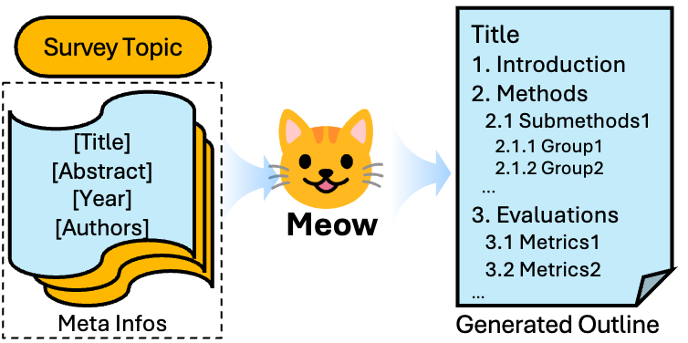

## Meow: 面向学术综述自动生成的端到端大纲写作模型

[English README](./README.md)

Meow 是一个端到端、元数据驱动的**学术综述大纲自动生成**模型。
给定目标主题和一组候选论文（标题 + 摘要），Meow 直接生成层级化的 survey 大纲，兼顾结构合理性、内容相关性与学术写作风格，为后续自动写作或人类撰写提供高质量基础。

---

### 亮点

- **端到端大纲生成**
  从「主题 + 元数据」直接到「完整层级大纲」，不依赖多代理、多阶段复杂 pipeline，更适合长上下文、批量自动化场景。

- **大规模高质量综述语料库** [\[dataset\]](https://huggingface.co/datasets/haajimi/Meow)
  - 2,828,998 篇 arXiv 论文元数据
  - 252,357 篇 bioRxiv，72,059 篇 medRxiv
  - 系统化过滤出高质量 survey，并抽取人工撰写的大纲、补全参考文献信息（包括通过语义检索补充摘要)。

- **两阶段训练：CoT + RL (GRPO)**
  - 使用 DeepSeek-R1 进行 **Chain-of-Thought 蒸馏**，学习从文献到 taxonomy / outline 的显式推理过程。
  - 在此基础上用 **Group Relative Policy Optimization (GRPO)** 强化学习，优化结构相似度与格式合规性奖励。

- **结构感知的奖励设计**
  - 使用 **Tree Edit Distance (TED)** 作为结构距离，衡量生成大纲与人工大纲的层级相似度。
  - 设计结构相似度奖励 + 格式合规奖励的组合，显式鼓励「长得像真正 survey」的结构。

---

### 模型示意图

<p align="center">
  
</p>

### 方法概述

- **任务定义**
  给定主题 $\mathcal{T}$ 和论文集合 $\mathcal{P} = \{p_i\}$，其中每篇 $p_i = (t_i, a_i)$ 为标题 + 摘要，目标是生成层级大纲 $\mathcal{O} = \{s_j\}_{j=1}^M$，每个 section $s_j$ 对应一个 heading $h_j$，要求：
  - 结构清晰、层次合理
  - 各部分内容边界明确，无冗余重叠
  - 对输入文献具备良好引用覆盖与逻辑组织能力

- **数据构建**
  - 关键词 + 结构规则筛选出 survey 论文
  - 清洗并标准化章节结构，去除致谢、附录等非核心部分
  - 用 `all-MiniLM-L6-v2` 向量化参考文献标题，从大规模元数据中检索匹配摘要，对引用进行补全
  - 利用 DeepSeek-R1 从参考文献推导 taxonomy 和 CoT 推理链条，用于监督训练

- **训练流程**
  - **阶段一：CoT 监督微调 (SFT)**
    在带 CoT 的数据上进行监督微调，学习从元数据到 outline 的显式推理 + 生成过程。
  - **阶段二：GRPO 强化学习**
    - 对每个输入采样多条候选大纲
    - 用结构相似度 + 格式合规性组成总奖励 $R_{\text{total}}$
    - 使用 GRPO 进行策略优化，并通过 KL 约束保持与参考策略的稳定性。

---

### 实验结果（LLM-as-a-Judge 与结构距离）

我们在自构测试集和 SurveyX 测试集上，对比多种主流 LLM 与学术基线模型。评测采用 LLM-as-a-Judge（五个维度）和 Structural Distance 两个指标，分数完全对应论文中的表格。

#### 自构测试集（Ours-100）

| **模型**               | **结构定位 ↑** | **结构细节 ↑** | **内容排他性 ↑** | **内容深度 ↑** | **语用简洁性 ↑** | **总分 ↑** | **结构距离 ↓** |
|------------------------|----------------|----------------|------------------|----------------|------------------|------------|----------------|
| 人工撰写               | 7.80           | 7.21           | 7.93             | 6.00           | 8.29             | 37.23      | 0.00           |
| DeepSeek-R1            | 8.09           | 5.31           | 8.15             | 5.75           | 8.85             | 36.15      | 0.48           |
| DeepSeek-V3            | 8.26           | 4.17           | 8.04             | 5.46           | 8.95             | 34.88      | 0.46           |
| GPT-5 Nano             | 6.99           | 5.66           | 6.19             | 5.04           | 7.84             | 31.72      | 0.46           |
| Gemini 2.5 Flash-Lite  | 8.01           | 5.68           | 8.18             | 5.84           | 8.72             | 36.43      | 0.52           |
| Qwen3-8B               | 4.97           | 3.71           | 4.47             | 3.65           | 4.62             | 21.42      | 0.59           |
| **Meow-8B-SFT**        | 7.79           | 6.75           | 7.11             | 5.34           | 8.11             | 35.10      | 0.43           |
| **Meow-8B-SFT-GRPO**   | 8.01           | 6.46           | 7.98             | 5.73           | 8.61             | **36.79**  | **0.39**       |

#### SurveyX 测试集

| **模型**             | **结构定位 ↑** | **结构细节 ↑** | **内容排他性 ↑** | **内容深度 ↑** | **语用简洁性 ↑** | **总分 ↑** | **结构距离 ↓** |
|----------------------|----------------|----------------|------------------|----------------|------------------|------------|----------------|
| 人工撰写             | 8.11           | 7.39           | 8.14             | 5.21           | 8.07             | 36.92      | 0.00           |
| SurveyX              | 7.37           | 5.30           | 4.60             | 3.90           | 8.43             | 29.60      | 0.44           |
| **Meow-8B-SFT**      | 6.56           | 5.83           | 7.33             | 5.28           | 7.83             | 32.83      | 0.53           |
| **Meow-8B-SFT-GRPO** | 7.71           | 6.12           | 7.71             | 5.46           | 8.62             | **35.62**  | **0.42**       |

> 从完整表格可以看到，**Meow-8B-SFT-GRPO** 在两个测试集上都取得了接近人工大纲的总分，以及所有模型中最低或接近最低的结构距离，说明强化学习阶段显著提升了大纲结构保真度和整体写作质量。

---

### 引用

如果本工作或本仓库对你的研究有帮助，请引用：

```bibtex
@article{ma2025meow,
  title   = {MEOW: End-to-End Outline Writing for Automatic Academic Survey},
  author  = {Ma, Zhaoyu and Shan, Yuan and Zhao, Jiahao and Xu, Nan and Wang, Lei},
  journal = {arXiv preprint arXiv:2509.19370},
  year    = {2025}
}
```
